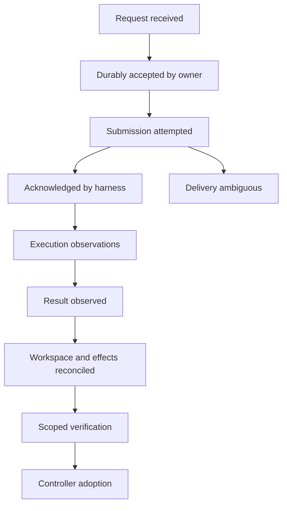
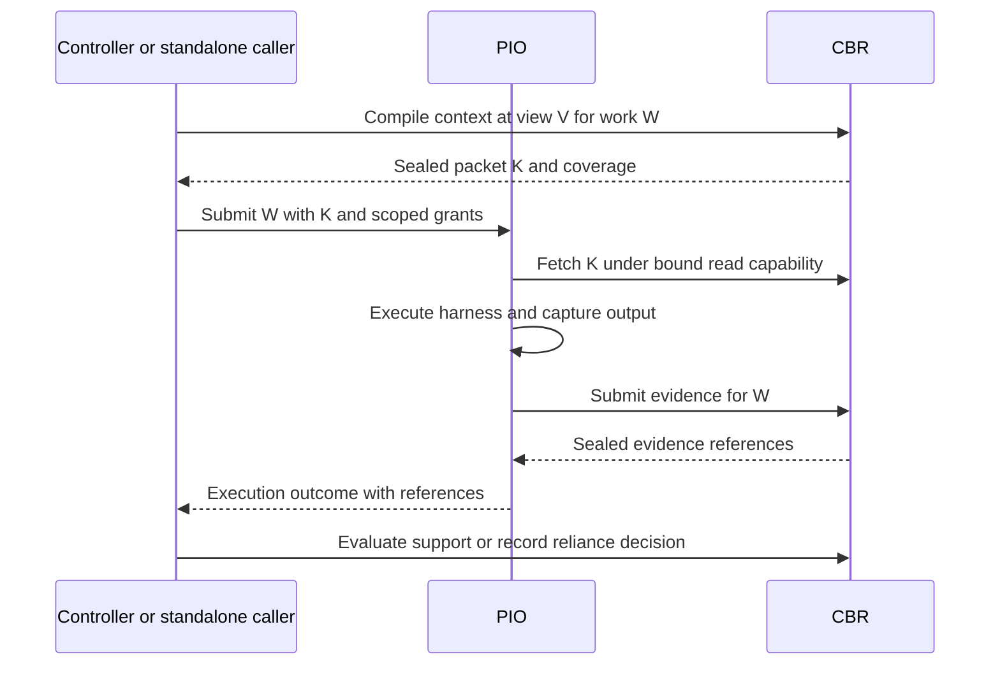

> Public edition `public-development-v1-20260913`. Adapted from the reviewed architecture baseline; names in the source may still say Comreton. See [publication and authority](https://github.com/Combraton/combraton/blob/main/docs/architecture/PUBLICATION.md). Development sequencing is governed by [DEVELOPMENT](https://github.com/Combraton/combraton/blob/main/docs/DEVELOPMENT.md); self-development is deferred until all four usable v0.1 releases.

# Protocol: independent semantic contracts

> Accepted protocol architecture in [BASELINE](https://github.com/Combraton/combraton/blob/main/docs/architecture/BASELINE.md). Names are illustrative until schemas and conformance fixtures are frozen together. The protocol is a separate project; it owns neither a scheduler nor a database.

## 1. Purpose

The protocol lets a controller request work, an execution service report what happened, and an evidence service supply cited context. Another application can adopt only the relevant parts. It does not require Comreton's canvas, template catalog, Rust implementation, or storage layout.

Reuse existing protocols at their appropriate boundary: MCP for tools/resources, ACP or native APIs for harness interaction, Git for code, OTLP for telemetry, and established artifact/attestation formats for exchange. None alone supplies cross-product execution identity, acceptance authority, revision checks, and recovery semantics.

## 2. Profiles over a small core

| Profile | Mandatory concepts | Typical participant |
|---|---|---|
| Core | Identity, schema/version negotiation, commands, errors, scoped authorization, observation cursors | Every participant |
| Execution | Execution/attempt binding, delivery proof, lifecycle, cancellation, reconciliation, usage | PIO or alternative executor |
| Evidence | Descriptor, upload/seal, provenance, retention, fetch/export | CBR, CI, runtime observer |
| Knowledge | Claim revisions, applicability, conflicts/drift, scoped reliance and authority binding | CBR or another knowledge service |
| Context | Request basis, budget, packet digest, citations, omissions, coverage | CBR or another context service |
| Verification | Contract references, subject digests, positive property results, scope and validity | Verifier provider |
| Coordination | Work sessions, workflow/template revisions, gates, project operations, branch adoption | Comreton or another controller |
| Remote trust | Endpoint identity, authenticated transport, scoped delegation, revocation, artifact transfer | Remote providers |

A CI evidence publisher need not understand templates. A PIO client need not implement claim acceptance. Profiles advertise dependencies and required features explicitly rather than using a single blanket “protocol compliant” label.

Every profile depends on Core. Knowledge uses Evidence descriptors for support. Context may compile raw evidence without implementing Knowledge; a packet that carries claims must preserve Knowledge identity, reliance, and applicability semantics. Verification uses Evidence descriptors and named contracts. Coordination binds whichever execution, knowledge, context, and verification providers the project selects. Required dependencies are declared in the negotiated profile manifest.

## 3. Identity and envelope

```json
{
  "protocol": "coordination/1",
  "message_id": "msg-unique",
  "kind": "command",
  "type": "execution.submit.v1",
  "producer": {"id": "controller-local", "epoch": 4},
  "subject": {"kind": "execution", "id": "exec-17"},
  "correlation": {"work_id": "work-9", "attempt_id": "attempt-3"},
  "caused_by": ["operation-41"],
  "command_id": "submit-exec-17",
  "expected_revision": 0,
  "payload_digest": {"sha256": "illustrative-digest"},
  "payload": {"brief_ref": "artifact-brief-17", "grant_ref": "grant-6"}
}
```

Do not confuse message ID, command ID, execution ID, request-response ID, and native turn ID. A retransmitted command keeps its command identity and payload. A fresh retry attempt gets a new execution identity linked to the previous attempt. Causation references explain why an event exists; timestamps and a global log position do not prove causality.

The expected revision refers to the named owner's subject, not another service's global position. This create example uses zero to mean “must not already exist,” after idempotency lookup. A command affecting several objects supplies explicit version preconditions for each relevant object.

An event additionally carries durable producer stream ID, stream epoch, sequence, owner revision, recorded time, and normalized payload. Wall-clock capture time is metadata with uncertainty; producer sequence orders a stream. A process restart normally resumes the same durable stream; an epoch change is explicit and comes with recovery coverage, not an excuse to discard gaps.

## 4. Command processing

1. Authenticate the channel and principal; validate scope and required profile.
2. Decode bounded payloads and reject unknown required semantic fields.
3. Check command ID and payload digest. A matching duplicate returns the prior result; a different payload is `idempotency_conflict`.
4. Check expected revision, relevant authority epoch, and permission scope.
5. In one owner transaction, commit the command result, domain events, and effect outbox.
6. Return durable acknowledgment, owner revision, and operation/effect references.

Untrusted unauthenticated traffic is rate-limited and logged separately; it does not fill the project authority journal. Authenticated semantic rejections receive bounded durable audit records when relevant to project history. A rejected query is not a project operation.

Deduplication retention must outlive the command's possible replay/reconciliation window. For an expired identity horizon, return `dedupe_history_unavailable`; do not guess that it is new and repeat a side effect. Dangerous effect identities retain compact tombstones until explicit lifecycle closure and replay policy make eviction safe.

## 5. Acknowledgments are facts, not one linear progress bar



Real events can be delayed or reordered; receipt of a result can establish progress even if an earlier optional signal was unavailable. Each fact has an evidence class and source. Do not manufacture all preceding states to make the diagram look linear.

`requires_action` is a runtime condition with an action ID and owner, not a higher acknowledgment level. `ambiguous` describes uncertainty about a delivery/effect episode. `cancel_requested` is not `cancelled`. A provider's durable acceptance is not Comreton's acceptance of the project outcome.

## 6. Delivery and reconciliation contract

Every external effect has a stable effect ID, kind, target, payload digest, authorization, retry class, and status evidence. Classify effects as pure, read/observe, idempotent with supported key, compensatable, or non-repeatable/opaque.

On response loss, query by the same effect ID. If the provider cannot answer, preserve an unresolved obligation. A read may be retried under its cost/privacy policy. An idempotent write can retry only within the provider's promised key semantics. A non-repeatable effect needs reconciliation or a new explicit decision.

Provider obligations can announce expected outcomes and terminal stream coverage, inspired by [Bazel BEP](https://bazel.build/remote/bep). Use this selectively for lifecycle and required artifacts, not for every token. A persisted timer can mark an overdue observation even when no other events arrive. Closing a wait with `aborted` closes the observation obligation; it does not prove that the external effect did not happen.

## 7. Durable subscriptions

Subscribe with profile/filter and cursor. Responses identify the snapshot/checkpoint basis and durable event positions. A consumer records events, its dedupe entries, and its advanced cursor atomically. Reconnect may replay duplicates; consumers handle them without repeating domain transitions.

Sequence gaps pause interpretation of dependent facts until repaired or declared unavailable. A retention gap returns a typed snapshot plus a coverage boundary. It does not present incomplete history as a complete replay. Consumers need normalized semantic payloads sufficient for their reducers; a prose summary and digest alone cannot reconstruct a decision.

Protocol events and high-volume telemetry have separate backpressure policies. Semantic events cannot be silently dropped. Output/log chunks may be coalesced or discarded only with an explicit lost range, byte count where known, and effect on evidence coverage.

## 8. Proposed operation families

| Owner/profile | Operations and return semantics |
|---|---|
| PIO/execution | `submit` → execution reference; `inspect/watch` → facts/cursors; `steer/cancel` → request receipt; `reconcile` → scoped observations |
| CBR/evidence | `prepare_upload/seal` → durable descriptor; `query/fetch` → authorized content; `hold/release` → retention obligation |
| CBR/context | `compile` → job/packet reference; `inspect_packet` → exact bytes and omissions; `expand` → newly authorized cited content |
| CBR/knowledge | `propose/evaluate` → revision/evaluation; `observe_decision` → acceptance projection update |
| Comreton/coordination | `propose_operations` → semantic diff; `apply_operations` → revision; `start/pause` → control receipt; `branch/restart/adopt` → operation and plan references |
| Verification | `evaluate_contract` → job reference; `report` → receipt with exact verified properties and unavailable checks |
| Provider/core | `describe/health/capabilities/watch_capabilities` → versioned capability snapshot |

Standalone CBR additionally exposes its local authority operations. The full profile disables competing local acceptance for a scope bound to Comreton.

The active CBR memory engine fits these existing operation families: compile can involve bounded investigation, and derived artifacts retain the existing Evidence/Knowledge semantics. Internal memory-job/checkpoint/SDK records do not become mandatory public workflow entities. Packet-size budget is distinct from authorized investigation effort and provider spending; any newly exposed required budget, cancellation or coverage field must be specified and negotiated before clients rely on it. This clarification adds no frozen methods or schema fields.

## 9. Direct PIO–CBR composition



The work binding constrains project/privacy scope, packet digest, evidence destination, allowed input reads, and producer identity. A direct connection reduces data forwarding without transferring scheduling or project acceptance authority.

## 10. Artifacts and attestations

Descriptors use algorithm-qualified digests, media type, size, owner/locator, producer, capture basis, visibility, and retention class. A locator is not identity and must not embed credentials. Compound manifests declare required child objects so incomplete bundles can be detected.

Use [in-toto Statements](https://github.com/in-toto/attestation/blob/2dcd055e9f72e746687c306e35f4e59720ff45be/spec/v1/statement.md) as an export-compatible shape for immutable subject digests and typed predicates. A domain-specific verification predicate records contract digest, evaluator, property results, subject, and environment. SLSA provenance applies when the artifact and execution actually fit its semantics; do not label every conversation a SLSA build.

Local authenticated provenance is required. Signed envelopes are a profile requirement where artifacts cross a trust boundary or need offline verification. Use vetted implementations after compatibility review, not hand-written cryptography. A signature proves attribution/integrity under a key policy, not correctness, independence, or adequate verification.

## 11. Versioning and transport

Negotiate supported major versions, profiles, required features, payload limits, and optional methods. Unknown optional metadata may be preserved; unknown required semantics fail closed. Active work pins the adapter/profile version that defines its meaning. Dynamic capability loss prevents new dependent admission and prompts reconciliation of existing work.

Recommended local transport: JSON-RPC 2.0 requests and domain event notifications over an authenticated Unix socket or named pipe, with explicit bounded framing. The domain envelope and cursor semantics remain independent of transport. A pinned transport specification must define encoding, maximum frame length, oversized-frame rejection, and disconnect behavior. JSON-RPC request IDs are not domain idempotency keys.

Remote profile uses authenticated TLS and the same domain contracts with scoped artifact transfer. No remote peer gets a writable local journal. MCP wraps domain operations as tools/resources; ACP remains below PIO. No custom JetStream clone or general broker is required for the initial local services.

## 12. Authorization and trust

Grants name principal, audience, resource scope, rights, authority epoch, expiry, and delegation bounds. Revocation prevents future mediated operations; already sent external effects still require reconciliation. Namespace visibility aids usability but cannot replace per-operation authorization.

Source code, transcripts, rendered HTML, plugin metadata, and model output remain untrusted input. Views render inert structured data. Cross-project retrieval and artifact sharing require explicit scope; deduplication must not leak another project's private content existence.

### Autonomy and steering across independent providers

A grant authorizes a scope of work; it is not a requirement for a controller round trip on each native tool call. Coordination conditions identify their governed transition and validation basis. Execution clients distinguish active repair, a dependent decision wait and denial of a particular effect. A failed verification receipt reports a scoped observation, not a universal stop command.

Steering correlation preserves the decision/context revision, target execution and native delivery identity when supported. Recorded request, acknowledged delivery and observed subsequent behavior remain separate facts. Unsupported live steering or enforcement returns an explicit capability limitation. Revocation does not claim cancellation or undo of an already-sent action. These are semantic requirements for the relevant profiles; names and schemas remain candidates. See [STEERING](https://github.com/Combraton/combraton/blob/main/docs/architecture/STEERING.md).

## 13. Conformance requirements

Test duplicate and conflicting command IDs; stale expected revisions; stale authority epochs; unknown required fields; partial artifact uploads; sequence gaps and retention gaps; duplicate event delivery; cancellation acknowledgment loss; delayed old-attempt result; two controllers claiming one host; provider reconnect with a changed capability; and offline signed artifact verification where the profile requires it.

A third-party minimal executor and a non-Comreton evidence publisher must pass relevant fixtures. If they need Comreton's internal library or database, the protocol has failed its independent-use requirement.

## 14. Context preparation and readiness interoperability

The Context profile must carry task/consumer identity, authority-selected required items and reliance labels, code/environment manifest, per-producer coverage, timing boundary and wait policy, deadline, internal investigation grant, output capacity, immutable packet/artifact identities, unmet items and invalidation conditions. The Execution profile binds the result to actual admission/delivery and later updates. [CBR delivery](https://github.com/Combraton/cbr/blob/main/docs/spec/PREPARATION-AND-DELIVERY.md) defines the required meanings; Phase 1 freezes fields, enums and negotiation fixtures.

Negotiate advisory enrichment, required-before-start and required-before-named-transition semantics explicitly. Timing does not override binding/evidence/hypothesis/reference reliance. A missing required item at deadline stays unmet. Unknown required semantics are refused; advisory degradation needs declared fallback. Consumers cannot reinterpret receipt as comprehension, a static explanation as runtime proof, or an event frontier as a simultaneous global snapshot.

Request identity precedes execution identity; preserve the causal association when preparation later results in admission. Multiple compatible consumers can share a CBR job while retaining separate request cancellations. Internal job details need not become mandatory public workflow entities. PIO enforcement applies to authorized execution binding, not ownership of project knowledge policy. Conformance includes late correction, missing context, stale basis, unsupported delivery and preparation/resource cycles.
